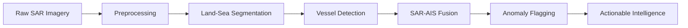

# 🛰️ Maritime Anomaly Fusion System (MAFS)

[](https://opensource.org/licenses/MIT)
[](https://www.python.org/downloads/)
[](https://pytorch.org/)
[](https://github.com/ultralytics/ultralytics)

An AI-powered maritime surveillance system leveraging SAR imagery and edge computing to combat drug trafficking and illegal fishing off Kenya's coast.

---

## 📋 Table of Contents

- [Problem Statement](#-problem-statement)
- [Solution Overview](#-solution-overview)
- [Technology Stack](#-technology-stack)
- [Architecture](#-architecture)
- [Key Features](#-key-features)
- [Performance Metrics](#-performance-metrics)
- [Deployment Options](#-deployment-options)
- [Impact](#-impact)
- [Installation](#-installation)
- [Usage](#-usage)
- [Contributing](#-contributing)
- [License](#-license)

---

## 🚨 Problem Statement

Kenya faces critical maritime security challenges:

### Drug Trafficking
- **Port of Mombasa** has become a major transit point for transnational drug networks
- **2024 Seizure**: 1,024 kg of crystal meth worth **$63 million** from a "dark vessel" 630 km east of Mombasa
- Detected seizures represent only a **fraction of total illicit activity**

### IUU Fishing
- **Illegal, Unreported, and Unregulated (IUU)** fishing costs Kenya over **$100 million annually**
- Depletes commercial fish stocks (tuna, marlin) through destructive practices
- Threatens sustainable blue economy development

### Surveillance Gap
Criminal operators exploit Kenya's vast **230,000 km² maritime territory** by:
- Disabling AIS transponders to evade detection
- Operating in largely unpatrolled waters
- Exploiting weather and daylight limitations of traditional surveillance

---

## 💡 Solution Overview

MAFS provides persistent, all-weather maritime domain awareness through:

| Feature | Description |
|---------|-------------|
| 🛰️ **SAR Technology** | Synthetic Aperture Radar (Sentinel-1) enables 24/7 monitoring regardless of weather or daylight |
| ⚡ **Edge AI Processing** | On-board inference using NVIDIA Jetson AGX Orin reduces latency by downlinking actionable intelligence instead of raw imagery |
| 🎯 **Dark Vessel Detection** | SAR-AIS fusion identifies vessels operating with disabled tracking systems |
| 🚨 **Real-time Alerts** | Automated flagging of suspicious activities like ship-to-ship transfers and loitering |

---

## 🛠️ Technology Stack

### Core Technologies

#### Computer Vision
- **YOLOv11m** object detection model
  - 4-5ms latency
  - 52.5% mAP
  - Optimized for detecting vessels of all sizes

#### Deep Learning Frameworks
- **PyTorch** for model training
- **Ultralytics YOLOv11** architecture
- **TensorBoard** for training metrics

#### Edge Deployment
- **NVIDIA Jetson AGX Orin** platform
- **ONNX** model conversion
- **TensorRT** acceleration (FP16/INT8 quantization)

---

## 🏗️ Architecture

### Processing Pipeline


#### 1. Preprocessing
- Radiometric and geometric calibration
- Lee Filter for speckle reduction
- Amplitude scaling and gamma correction (γ=0.6)
- CLAHE for contrast enhancement

#### 2. Land-Sea Segmentation
- Otsu global thresholding + adaptive Gaussian thresholding
- Morphological operations (closing/opening)
- Iterative refinement

#### 3. Vessel Detection
- YOLOv11m inference on VV/VH polarized SAR
- Inference slicing for large images
- Edge-optimized processing

#### 4. SAR-AIS Fusion
- Spatial matching (1 km radius)
- Temporal correlation
- Anomaly flagging for dark vessels

---

## ✨ Key Features

✅ **All-weather, 24/7 operation** via SAR technology  
✅ **Edge AI processing** for near-real-time intelligence  
✅ **Dark vessel detection** through SAR-AIS fusion  
✅ **Optimized for resource-constrained hardware**  
✅ **Dockerized deployment** for satellite integration  
✅ **Dual-mode operation** (web app + sovereign deployment)

---

## 📊 Performance Metrics

| Metric | Value |
|--------|-------|
| **Latency** | 4-5ms detection time |
| **Accuracy** | 52.5% mAP |
| **Geolocation** | <20m deviation with proper calibration |
| **Coverage** | 230,000+ km² maritime area |

---

## 🚀 Deployment Options

### Use Case 1: Web Application
Users with SAR data can:
- Upload imagery through a web interface
- Select regions of interest to analyze historical Sentinel-1 data
- Visualize detected vessels and anomalies

### Use Case 2: Sovereign Maritime Surveillance
Full deployment on satellite constellations (e.g., Star Vision) for:
- Real-time on-orbit processing
- Automated intelligence downlink
- Continuous maritime domain awareness

---

## 🌍 Impact

### 🔒 National Security
- Continuous surveillance of 230,000 km² maritime territory
- Detection of drug smuggling vessels using AIS manipulation
- Early warning of suspicious ship-to-ship transfers

### 🌱 Sustainable Development
- Protection of $100M+ annual revenue from IUU fishing
- Conservation of tuna, marlin, and other commercial species
- Preservation of artisanal fisher livelihoods
- Support for Kenya's sustainable blue economy

### 🏛️ Governance
- AI-driven decision support for maritime authorities
- Reduced response times through edge processing
- Scalable, all-weather monitoring capability

---

## 📦 Installation

### Prerequisites
- Python 3.8+
- CUDA 11.8+ (for GPU acceleration)
- Docker (for containerized deployment)

### Setup
```bash
# Clone the repository
git clone https://github.com/yourusername/MAFS.git
cd MAFS

# Create virtual environment
python -m venv venv
source venv/bin/activate  # On Windows: venv\Scripts\activate

# Install dependencies
pip install -r requirements.txt

# Download pre-trained weights
wget https://path-to-weights/yolov11m-mafs.pt -P weights/
```

### Docker Deployment
```bash
# Build Docker image
docker build -t mafs:latest .

# Run container
docker run --gpus all -p 8000:8000 mafs:latest
```

---

## 🎯 Usage

### Web Application
```bash
# Start the web server
python app.py

# Access the interface at http://localhost:8000
```

### CLI Inference
```python
from mafs import MAFSDetector

# Initialize detector
detector = MAFSDetector(
    model_path='weights/yolov11m-mafs.pt',
    device='cuda'
)

# Process SAR imagery
results = detector.detect(
    sar_image_path='path/to/sentinel1.tiff',
    ais_data='path/to/ais.csv'
)

# Get anomalies
anomalies = results.get_dark_vessels()
print(f"Detected {len(anomalies)} dark vessels")
```

### Edge Deployment (Jetson AGX Orin)
```bash
# Convert model to TensorRT
python scripts/convert_to_tensorrt.py \
    --weights weights/yolov11m-mafs.pt \
    --precision fp16 \
    --output weights/yolov11m-mafs.engine

# Run edge inference
python edge_inference.py \
    --engine weights/yolov11m-mafs.engine \
    --input /dev/video0
```

---

## 📁 Project Structure
```
MAFS/
├── data/
│   ├── sar/              # SAR imagery dataset
│   ├── ais/              # AIS tracking data
│   └── annotations/      # Training annotations
├── models/
│   ├── yolov11/          # YOLOv11 architecture
│   └── preprocessing/    # Preprocessing modules
├── scripts/
│   ├── train.py          # Training script
│   ├── evaluate.py       # Evaluation script
│   └── convert_to_tensorrt.py
├── web/
│   ├── app.py            # Flask/FastAPI application
│   └── templates/        # Web interface
├── edge/
│   ├── edge_inference.py # Jetson deployment
│   └── Dockerfile        # Edge container
├── requirements.txt
├── README.md
└── LICENSE
```

---

## 🤝 Contributing

We welcome contributions! Please see our [Contributing Guidelines](CONTRIBUTING.md) for details.

1. Fork the repository
2. Create your feature branch (`git checkout -b feature/AmazingFeature`)
3. Commit your changes (`git commit -m 'Add some AmazingFeature'`)
4. Push to the branch (`git push origin feature/AmazingFeature`)
5. Open a Pull Request

---

## 📄 License

This project is licensed under the MIT License - see the [LICENSE](LICENSE) file for details.

---

## 🙏 Acknowledgments

- **Sentinel-1 SAR Data**: European Space Agency (ESA) Copernicus Programme
- **YOLOv11**: Ultralytics team
- **Edge Computing**: NVIDIA Jetson platform
- **Funding**: [Your funding organization]

---

## 📧 Contact

**Project Maintainer**: Your Name  
**Email**: your.email@example.com  
**Organization**: [Your Organization]

---

## 🎯 Thematic Alignment

**AI for National Prosperity**: Leverages machine learning to strengthen maritime security, protect natural resources, and support sustainable economic development in Kenya's blue economy sector.

---

<p align="center">
  <i>Developed to address critical maritime security challenges facing Kenya's coastal waters and Port of Mombasa.</i>
</p>

